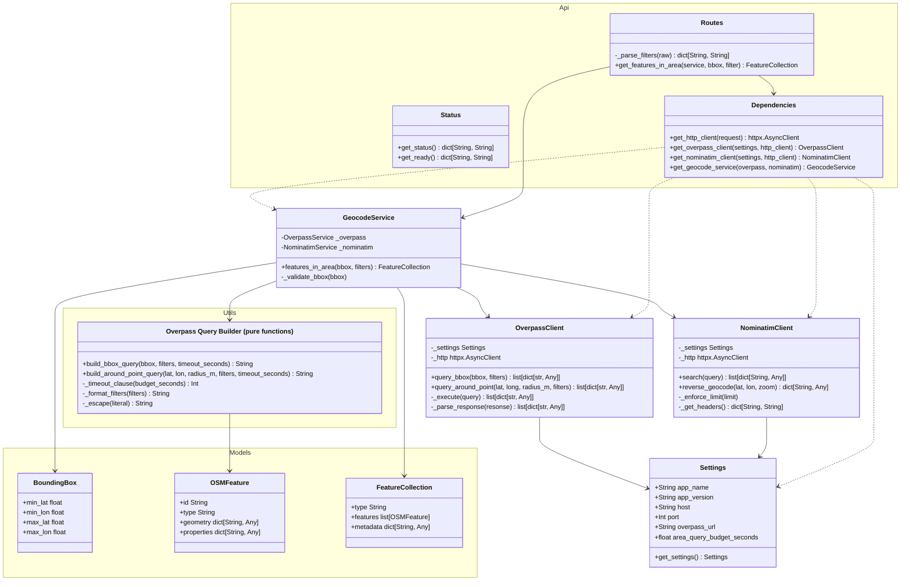

# microgeo
Local microservice that wraps the public Overpass API (OSM data) and Nominatim (geocoding) behind a small REST API. Other local applications consume it over HTTP.

## Project Structure
```
microgeo/
├── app/
│   ├── main.py       # app factory, lifespan, exception handlers
│   ├── api/          # /v1 endpoints (area, point, search)
│   ├── services/     # Ochestration, async Overpass, async Nominatim
│   ├── models/       # request/response models
│   └── core/         # Settings via env / .env file, app logics
├── tests/
├── pyproject.toml
└── .env
```

## Public API

| User Story             | Method | Path               | Purpose                                      |
|------------------------|--------|--------------------|----------------------------------------------|
| 1. Specify an Area     | GET    | /v1/features/area  | OSM features inside a bounding box           |
| 2. Select a Location   | GET    | /v1/features/point | OSM features at a specific lat/lon           |
| 3. Search for Location | GET    | /v1/search         | Forward-geocode a name, address, or category |
|                        | GET    | /v1/status         | Returns status of the service                |

OSM tag filters are pass as repeated `filter=key=value` query parameters:
```http request
GET /v1/features/area?min_lat=34.0&min_lon=-117.2&max_lat=34.1&max_lon=-117.1&filter=amenity=cafe
GET /v1/features/point?lat=34.0556&lon=-117.1825&filter=amenity=restaurant
GET /v1/search?q=Oregon+State+University&limit=5
```

## How to Request Data
To request data, use an HTTP GET request to the target endpoint with necessary query parameters.

Available Endpoints:
``` 
GET /v1/search
GET /v1/features/area
```

Example Calls:
``` python
import requests

BASE_URL = "http://localhost:8000"

# Example 1: Requesting a location search
search_params = {
    "q": "Corvallis, Oregon",
    "limit": 1,
    "country": ["us"]
}
search_response = requests.get(f"{BASE_URL}/v1/search", params=search_params)

# Example 2: Requesting features in a bounding box
bbox_params = {
    "min_lat": 44.550,
    "min_lon": -123.290,
    "max_lat": 44.580,
    "max_lon": -123.250,
    "filter": ["amenity=cafe", "cuisine=coffee_shop"]
}
bbox_response = requests.get(f"{BASE_URL}/v1/features/area", params=bbox_params)
```

## How to Receive Data
The microgeo service response with a JSON payload. To process the data, the JSON response must be deserialized and then iterate through the features array.

Example Receive and Process:

``` python
if search_response.status_code == 200:
    data = search_response.json()
    
    # The 'features' list contains the geographic data
    features = data.get("features", [])
    for feature in features:
        coordinates = feature["geometry"]["coordinates"] # [longitude, latitude]
        properties = feature["properties"]
        print(f"Found: {properties.get('display_name')} at {coordinates}")
else:
    print(f"Error: {search_response.status_code} - {search_response.text}")
```

## UML Diagram


## Sequence Diagram
```mermaid
sequenceDiagram
    autonumber
    actor Client
    participant FastAPI as FastAPI (main.py)
    participant Routes as Routes (api/routes.py)
    participant Deps as Dependencies (api/dependencies.py)
    participant Service as GeocodeService
    participant Overpass as OverpassClient
    participant Nominatim as NominatimClient
    participant QB as OverpassQueryBuilder
    participant Map as Mappers (overpass/nominatim_mapping)
    participant HTTP as httpx.AsyncClient
    participant OverpassAPI as Overpass API
    participant NominatimAPI as Nominatim API
    Note over FastAPI,HTTP: Startup — lifespan creates a shared httpx.AsyncClient on app.state
    %% --- /v1/features/area ---
    Note over Client,OverpassAPI: GET /v1/features/area?min_lat=&min_lon=&max_lat=&max_lon=&filter=key=value
    Client->>FastAPI: HTTP GET /v1/features/area
    FastAPI->>Routes: dispatch get_features_in_area(...)
    Routes->>Deps: resolve GeocodeServiceDep
    Deps->>Deps: get_settings(), get_http_client()
    Deps->>Overpass: new OverpassClient(settings, http)
    Deps->>Nominatim: new NominatimClient(settings, http)
    Deps->>Service: new GeocodeService(overpass, nominatim)
    Routes->>Routes: _parse_filters(filter) -> dict
    Routes->>Service: features_in_area(bbox, filters)
    Service->>Service: _validate_bbox(bbox)
    Service->>Overpass: query_bbox(min/max lat/lon, filters)
    Overpass->>QB: build_bbox_query(bbox, filters, timeout)
    QB-->>Overpass: Overpass QL string
    Overpass->>HTTP: POST overpass_url (data=query)
    HTTP->>OverpassAPI: POST /interpreter
    OverpassAPI-->>HTTP: 200 JSON {elements:[...]}
    HTTP-->>Overpass: Response
    Overpass->>Overpass: _parse_response(response)
    Overpass-->>Service: list[OSM element dicts]
    Service->>Map: map_elements(elements)
    Map-->>Service: list[OSMFeature]
    Service-->>Routes: FeatureCollection(features, metadata)
    Routes-->>FastAPI: FeatureCollection
    FastAPI-->>Client: 200 OK JSON
    %% --- /v1/features/point ---
    Note over Client,OverpassAPI: GET /v1/features/point?lat=&lon=&radius=&filter=key=value
    Client->>FastAPI: HTTP GET /v1/features/point
    FastAPI->>Routes: dispatch get_features_at_point(...)
    Routes->>Deps: resolve GeocodeServiceDep
    Deps-->>Routes: GeocodeService (shared http client)
    Routes->>Service: features_at_point(point, radius, filters)
    Service->>Overpass: query_around_point(lat, lon, radius_m, filters)
    Overpass->>QB: build_around_point_query(...)
    QB-->>Overpass: Overpass QL string
    Overpass->>HTTP: POST overpass_url (data=query)
    HTTP->>OverpassAPI: POST /interpreter
    OverpassAPI-->>HTTP: 200 JSON {elements:[...]}
    HTTP-->>Overpass: Response
    Overpass-->>Service: list[elements]
    Service->>Map: map_elements(elements)
    Map-->>Service: list[OSMFeature]
    Service-->>Routes: FeatureCollection
    Routes-->>FastAPI: FeatureCollection
    FastAPI-->>Client: 200 OK JSON
    %% --- /v1/search ---
    Note over Client,NominatimAPI: GET /v1/search?q=&limit=&country=
    Client->>FastAPI: HTTP GET /v1/search
    FastAPI->>Routes: dispatch search_location(...)
    Routes->>Deps: resolve GeocodeServiceDep
    Deps-->>Routes: GeocodeService
    Routes->>Service: search(q, limit, country)
    Service->>Nominatim: search(query, limit, countryCodes)
    Nominatim->>Nominatim: _enforce_rate_limit() (1 req/s)
    Nominatim->>Nominatim: _get_headers() (User-Agent)
    Nominatim->>HTTP: GET nominatim_url/search?q=...
    HTTP->>NominatimAPI: GET /search
    NominatimAPI-->>HTTP: 200 JSON [...]
    HTTP-->>Nominatim: Response
    Nominatim-->>Service: list[nominatim result dicts]
    Service->>Map: map_nominatim_results(results)
    Map-->>Service: list[OSMFeature]
    Service-->>Routes: FeatureCollection
    Routes-->>FastAPI: FeatureCollection
    FastAPI-->>Client: 200 OK JSON
    %% --- Error path (illustrative) ---
    Note over Overpass,OverpassAPI: Error path — Overpass returns 429/504/5xx or httpx raises
    Overpass->>HTTP: POST overpass_url
    HTTP-->>Overpass: 429 / 504 / 5xx or TimeoutException
    Overpass-->>Service: raises Exception
    Service-->>FastAPI: propagates exception
    FastAPI-->>Client: HTTP 500 (via FastAPI default handler)
    Note over FastAPI,HTTP: Shutdown — lifespan closes the shared httpx.AsyncClient
 ```


## Git Workflow

#### Sync main before branching
1. `git checkout main`
2. `git pull --rebase origin main`

#### Create branch
1. `git checkout -b feature/task`

#### Write Code/Commit locally
1. `git add .`
2. `git commit -m "message"`

#### To squash a small commit into a bigger one
1. `git rebase -i HEAD~n`

#### Update branch before pushing
1. `git fetch origin` (or git pull)
2. `git rebase origin/main`

#### Push for PR
1. `git push -u origin feature/task`

